  

  
<strong>Full-stack developer · Healthcare systems · Reporting tools</strong>

  

    <a href="https://www.linkedin.com/in/awad-emad-81089118b/">LinkedIn</a>
    &nbsp;·&nbsp;
    <a href="https://github.com/awad19977?tab=repositories">Repositories</a>
    &nbsp;·&nbsp;
    <a href="https://github.com/awad19977/Report-Intelligence-Platform">Current open-source work</a>
  

---

### The work behind the code

I build software for the places where a clear screen and accurate data make a real difference. At **Aliaa Specialist Hospital**, I work across clinical and administrative workflows: patient registration, appointments, laboratory requests, billing, service queues, reporting, and production support.

My approach is to understand the workflow first, trace it through the application and database, then make the result dependable for the people using it every day.

<table>
  <tr>
    <td width="33%" valign="top">
      <strong>01 / Understand</strong>  Map what staff need and where a process slows down.
    </td>
    <td width="33%" valign="top">
      <strong>02 / Build</strong>  Connect interfaces, APIs, data, and integrations into one usable flow.
    </td>
    <td width="33%" valign="top">
      <strong>03 / Support</strong>  Keep the software reliable after it reaches a live environment.
    </td>
  </tr>
</table>

### Selected work

| Project | What it does | Stack |
| :--- | :--- | :--- |
| **[Report Intelligence Platform](https://github.com/awad19977/Report-Intelligence-Platform)** | Open-source CLI and MCP tools that inspect Crystal Reports: structure, data sources, SQL commands, parameters, formulas, and subreports. | TypeScript · Node.js · MCP |
| **[Cafeteria POS](https://github.com/awad19977/Cafeteria-POS)** | Point-of-sale web app for cashier, inventory, and kitchen workflows. | React Router · Hono · PostgreSQL |
| **Hospital information systems** | Professional work on clinical and administrative applications at Aliaa Specialist Hospital. | C# · .NET · SQL Server · React |

### My toolkit

**Applications** &nbsp; C# · ASP.NET Core · React · TypeScript · Node.js  
**Data & reporting** &nbsp; SQL Server · T-SQL · PostgreSQL · Crystal Reports  
**What I care about** &nbsp; Clear workflows · Data accuracy · Practical integrations · Maintainable code

### What I'm working toward

I'm interested in full-stack and healthcare technology roles where I can modernize important systems and ship software people rely on. Explore my [public repositories](https://github.com/awad19977?tab=repositories) or [connect on LinkedIn](https://www.linkedin.com/in/awad-emad-81089118b/).
