<div align="center">
  
  <br/><br/>
  
  <h1>Hi, I'm Awad Emad 👋</h1>
  <p><strong>Full-stack developer turning complex healthcare workflows into software people can trust.</strong></p>
  <p>Hospital systems · Product web and mobile · Data and reporting</p>
  <p>
    <a href="https://www.linkedin.com/in/awad-emad-81089118b/"></a>
    <a href="https://github.com/awad19977?tab=repositories"></a>
  </p>
</div>

---

### 👋 A little about me

I have built and supported software at **Aliaa Specialist Hospital since 2017**, working across clinical, administrative, and operational workflows. My work connects established **C#/.NET and SQL Server** systems with modern **React, TypeScript, and mobile** experiences.

> I care about the moment software meets real work: a patient booking, a lab result, a medication sale, or a report someone uses to make a decision.

```text
My approach: understand the workflow → trace the data → build the right tool → support it in daily use
```

### ⚡ What I build

<table>
  <tr>
    <td width="50%" valign="top"><h3>🏥 Hospital platforms</h3>Patient journeys, clinical work, billing, insurance, ERP, and integrations across departments.<br/><br/><sub>C# · .NET · SQL Server · React</sub></td>
    <td width="50%" valign="top"><h3>📱 Connected experiences</h3>Patient portals, mobile apps, and clinician tools that carry the same workflow across devices.<br/><br/><sub>TypeScript · React Router · Expo · Flutter</sub></td>
  </tr>
  <tr>
    <td width="50%" valign="top"><h3>🧪 Diagnostics and data</h3>Laboratory results, medical imaging, reporting, and tools that make complex information usable.<br/><br/><sub>WPF · DICOMweb · Crystal Reports · MCP</sub></td>
    <td width="50%" valign="top"><h3>⚙️ Operations software</h3>Pharmacy, production, attendance, point of sale, and team coordination systems.<br/><br/><sub>Blazor · Hono · PostgreSQL · React Native</sub></td>
  </tr>
</table>

### 🚀 Selected projects

<table>
  <tr>
    <td width="50%" valign="top">
      <h3>🏥 Hospital Information System + ERP</h3>
      Multi-branch platform spanning registration, appointments, clinical encounters, diagnostics, pharmacy, billing and insurance, inventory, finance, and HR.<br/><br/>
      <sub>React Router · Hono · SQL Server</sub>
    </td>
    <td width="50%" valign="top">
      <h3>💊 Pharmacy Management System</h3>
      Web and mobile tools for point of sale, stock and barcode handling, suppliers, reporting, and financial views.<br/><br/>
      <sub>React Router · Hono · Expo · PostgreSQL</sub>
    </td>
  </tr>
  <tr>
    <td width="50%" valign="top">
      <h3>🔬 LIS Desktop App</h3>
      Laboratory workflows for patients, test orders, results, verification, reports, and analyzer connectivity.<br/><br/>
      <sub>.NET 8 · WPF · SQL Server · HL7/ASTM</sub>
    </td>
    <td width="50%" valign="top">
      <h3>📊 <a href="https://github.com/awad19977/Report-Intelligence-Platform">Report Intelligence Platform ↗</a></h3>
      Open-source CLI and MCP tools that inspect Crystal Reports: structure, data sources, SQL commands, parameters, formulas, and subreports.<br/><br/>
      <sub>TypeScript · Node.js · public repository</sub>
    </td>
  </tr>
</table>

### 🧭 More of my work

The projects below are separate apps and systems. Professional and in-progress work is described at the feature level; source links appear only where a repository is public.

<details open>
<summary><strong>Healthcare and patient care · 5 projects</strong></summary>

| Project | What it helps people do |
| :--- | :--- |
| **Patient portal** | Find doctors and services, create an account, book and manage appointments, and view results and bills. <br/><sub>React Router · SQL Server</sub> |
| **Patient mobile app** | Manage appointments, results, medication reminders, bills, queue information, consent, and family access in Arabic or English. <br/><sub>Expo · React Native</sub> |
| **Patient app backend** | Connect mobile accounts and sessions to hospital bookings, results, bills, consent, and family links. <br/><sub>Node.js · SQL Server</sub> |
| **Clinician and manager tablet** | Support rounds, patient charts, notes, quick orders, queues, dashboards, and approvals, including an offline write queue. <br/><sub>Expo · React Native</sub> |
| **PACS_Sys** | DICOM imaging prototype with a viewer, study search, clinical worklists and reports, administration, and audit surfaces. A field pilot remains planned. <br/><sub>React · TypeScript · DICOMweb</sub> |

</details>

<details open>
<summary><strong>Operations and teams · 6 projects</strong></summary>

| Project | What it helps people do |
| :--- | :--- |
| **EMPZKteco** | Manage employee attendance, ZKTeco devices, punch collection, enrollment, monitoring, and reports. <br/><sub>.NET 8 · Blazor · SQL Server</sub> |
| **Production Manager** | Track production orders and recipes, stock purchasing and unit conversion, sales, expenses, and reports. <br/><sub>React Router · Hono · PostgreSQL</sub> |
| **Activation Issuer Mobile** | Import an issuer key, generate signed licenses, review local history, and export encrypted backups. <br/><sub>Expo · React Native</sub> |
| **TeamSync Web** | Coordinate contacts, departments, tickets, tasks, routines, timetables, approvals, reports, and notifications. <br/><sub>React Router · Hono · PostgreSQL</sub> |
| **TeamSync Mobile** | Bring contacts, tasks, tickets, routines, timetables, approvals, notifications, and offline sync to mobile. <br/><sub>Flutter · Riverpod</sub> |
| **[Cafeteria POS ↗](https://github.com/awad19977/Cafeteria-POS)** | Support cashier, inventory, and kitchen workflows in one point-of-sale web app. <br/><sub>React Router · Hono · PostgreSQL · public repository</sub> |

</details>

### 🧰 Tech stack

**Web and APIs**<br/>
    

**Desktop and enterprise**<br/>
   

**Data and reporting**<br/>
   

**Mobile and interfaces**<br/>
   

**Integration and delivery**<br/>
    

### 🔧 Skills shaped by real workflows

- **Healthcare interoperability:** DICOM imaging, lab analyzer messaging, and TCP/IP device connections.
- **Operational reliability:** offline mobile queues, Windows print services and label printing, and Arabic/English patient and queue experiences.
- **End-to-end delivery:** tracing screens through APIs and databases, automated checks, CI workflows, npm packages, and MCP tools.

### 📈 GitHub activity

<div align="center">
  <a href="https://github.com/awad19977?tab=repositories"></a>
  <a href="https://github.com/awad19977?tab=repositories"></a>
</div>

<p align="center"><sub>These automated cards count public repository activity. The professional systems above include private work.</sub><br/><a href="https://github.com/awad19977">Explore my full GitHub contribution graph ↗</a></p>

### 🏆 GitHub achievements

<table>
  <tr>
    <td align="center" width="25%"><a href="https://github.com/awad19977?achievement=pair-extraordinaire&amp;tab=achievements"><strong>🤝 Pair Extraordinaire</strong></a><br/><sub>Collaborative pull requests</sub></td>
    <td align="center" width="25%"><a href="https://github.com/awad19977?achievement=pull-shark&amp;tab=achievements"><strong>🦈 Pull Shark ×2</strong></a><br/><sub>Merged pull requests</sub></td>
    <td align="center" width="25%"><a href="https://github.com/awad19977?achievement=quickdraw&amp;tab=achievements"><strong>⚡ Quickdraw</strong></a><br/><sub>Fast issue response</sub></td>
    <td align="center" width="25%"><a href="https://github.com/awad19977?achievement=yolo&amp;tab=achievements"><strong>🚀 YOLO</strong></a><br/><sub>Direct pull request merge</sub></td>
  </tr>
</table>

### 📍 The path so far

**2017–present · Software Developer, Aliaa Specialist Hospital**  
Hospital information systems, ERP workflows, SQL Server development, integrations, deployment support, and collaboration with clinical and administrative staff.

**2014–2016 · Software Developer, SCABS Engineering**  
Earlier software development experience.

**BSc Computer Science · Omdurman Islamic University**

---

<div align="center">
  <h3>Let's build software that helps people do important work.</h3>
  <p>I'm interested in full-stack and healthcare technology roles.</p>
  <a href="https://www.linkedin.com/in/awad-emad-81089118b/"></a>
</div>
